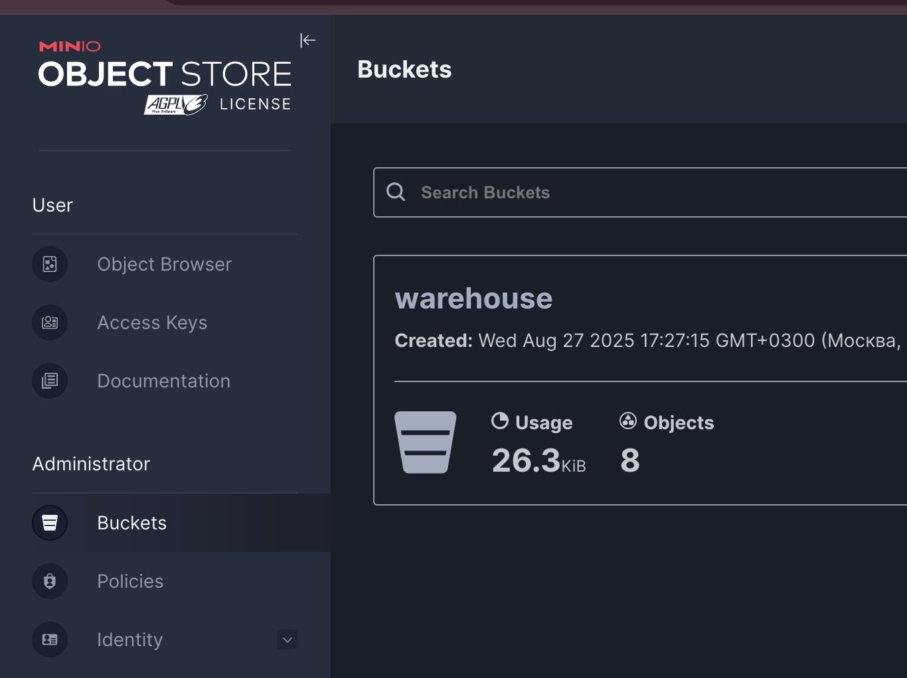
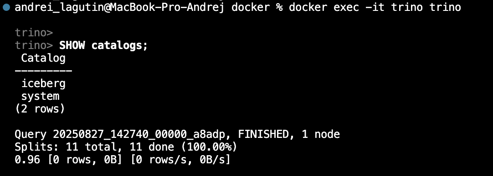

# Iceberg + MinIO + Trino (local)

Локальный стенд для экспериментов с Apache Iceberg:  
- **MinIO** — S3-совместимое хранилище  
- **Iceberg REST Catalog** — каталог Iceberg поверх S3/MinIO  
- **Trino** — SQL-движок  

## Состав

docker-compose.yml — сервисы: minio, iceberg-rest, trino, postgres
catalog/iceberg.properties — коннектор Trino ↔ Iceberg (REST)
catalog/postgres.properties — коннектор Trino ↔ PostgreSQL
postgres/init/01_seed.sql — авто-инициализация Postgres (демо-таблица customers)
start.sh, stop.sh, clean.sh — запуск/остановка/очистка
env.example → env.list — переменные окружения (локально, не коммитится)
data/ — локальные данные MinIO (в .gitignore)
images/ — скриншоты

## Требования
- Docker Desktop (macOS/linux)
- Композ собран на arm64 
- у меня старая версия docker, в новой версии надо потереть в докер композе - version: "3.9"
На обычном Linux (x86_64/amd64 или arm64) не нужно форсировать архитектуру. 
В docker-compose.yml просто уберите строки platform: linux/arm64 у всех сервисов. Docker сам подтянет нативные образы под твою архитектуру.

## Быстрый старт

Подготовка переменных окружения
Создай `env.list` из шаблона:
``` bash
cp env.example env.list
```

## старт 
``` bash
./start.sh
# или docker compose up -d --build
```

## Если все ок 

Зайти в MinIO и создать бакет warehouse
Мы используем CATALOG_WAREHOUSE=s3://warehouse/. Этот бакет должен существовать.
Через веб-консоль:
Открой http://localhost:9001
Войди: minioadmin / minioadmin
Раздел Buckets → Create Bucket → имя: warehouse → Create.

## Зайти в Трино 
``` bash 
docker exec -it trino trino
```

``` sql 
-- посмотреть каталоги
SHOW catalogs;

-- создать схему (namespace) в Iceberg
CREATE SCHEMA iceberg.demo;

-- создать таблицу
CREATE TABLE iceberg.demo.customer (
  id INT,
  first_name VARCHAR,
  last_name  VARCHAR,
  age INT
);

-- вставить данные
INSERT INTO iceberg.demo.customer (id, first_name, last_name, age) VALUES
  (1, 'John', 'Doe', 24),
  (2, 'Jane', 'Brown', 28),
  (3, 'Alice','Johnson', 32),
  (4, 'Bob',  'Williams',26),
  (5, 'Charlie','Smith', 35);

-- проверить
SELECT * FROM iceberg.demo.customer;
```

## postgres/init/01_seed.sql (выполняется при первом старте контейнера Postgres):

Если БД уже инициализирована, сиды повторно не применяются

## Сброс  Postgres (чтобы снова применились сиды)

docker compose down
docker volume rm $(basename "$PWD")_pg_data
docker compose up -d

## Федеративный запрос (Iceberg ↔ PostgreSQL)

``` sql 
SELECT
  o.order_id,
  c.customer_name,
  o.amount,
  c.country
FROM iceberg.demo.orders o
JOIN postgres.public.customers c
  ON o.customer_id = c.customer_id
ORDER BY o.order_id;
``` 
## Смотрим в Веб Минио 

Посмотреть файлы в MinIO

Зайди в http://localhost:9001
 → бакет warehouse → путь demo/customer/.
Там будут:
metadata/ — метаданные Iceberg (манифесты, snapshots и т.д.)
data/ — файлы Parquet.


## Остановка и очистка
``` bash 
./stop.sh
./clean.sh        # спросит подтверждение и удалит ./data + тома
./clean.sh --all  # дополнительно удалит docker-образы
``` 







